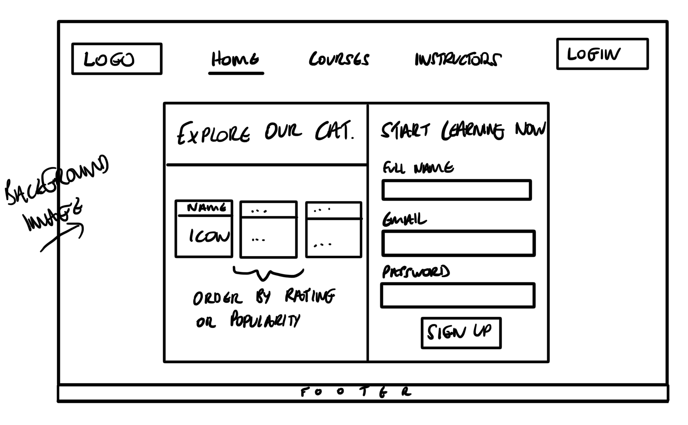

# Project 4: Learn

## Overview
In this project I worked in a pair with Rizwan where we built another full stack web application, this time using Django REST framework with a React Frontend. In the spirit of moving online during lockdown, we decided to try our hand at building an E-Learning platform where users can upload courses as Instructors or take a course as a Learner.

### Deployed Project
You can find this deployed [here](https://learn-as.netlify.app/).

### Web Technologies / Frameworks
* Django REST Framework
* Python
* SQL
* TablePlus
* React.js
* JavaScript

### Tools* Zoom
* Github
* Visual Studio Live Share
* Excalidraw - White boarding 
* Slack
* Trello
* Cloudinary
* Entity Relationship Diagram (ERD) Modelling using [dbdiagram.io](https://dbdiagram.io/)

### Technical Requirements
* **Build a full-stack application** by making your own backend and your own front-end
* **Use a Python Django API** using Django REST Framework to serve your data from a Postgres database
* **Consume your API with a separate front-end** built with React
* **Be a complete product** which most likely means multiple relationships and CRUD functionality for at least a couple of models
* **Implement thoughtful user stories/wireframes** that are significant enough to help you know which features are core MVP and which you can cut
* **Have a visually impressive design** to kick your portfolio up a notch and have something to wow future clients & employers. **ALLOW** time for this.
* **Be deployed online** so it’s publicly accessible.

### Application Flow
*Homepage*


*Courses*


*Lesson - KS3 Science / Chemistry*


## Approach
### Planning
This time we started with visualising the product we aimed to build by discussing the features we wanted to implement and used wireframes to stay mindful of the user experience. Here is a list of the core functionalities:

### Functionality
* An Instructor can create a Course, Lesson, Assessment.
* An Instructor can only delete a Course, Lesson, Assessment that they own.
* An Instructor can edit their own Course.
* A Learner can view all Course resources.
* Assessments will be multiple choice based Questions and Answers.
* Register and Login.

### Wireframes & ERD



Once we had a clearer scope for idea, I attempted to model the database design and structure using an Entity Relationship Diagram (ERD). This helped us visualise the tables and fields in our database and the relationships between our Models. 

**Note:** Due to changes made on the fly, this is not an accurate representation of the final structure.

*ERD*


### Division of Tasks
* I worked on the ERD, Authentication, React Forms, User Role.
* Rizwan worked on the Serialisers and mainly the Views.
* We both worked on the Wireframes, Django Settings, Models, some parts of the Views, URLs.

We also used Trello to help us guage our workload and track our progress:


### Getting Setup
We then worked through the configuration steps of setting up a Django project.

1. Create a virtual environment to isolate our package dependencies locally with Pip.
2. Install Django and Django REST framework into the virtual environment.
3. Register a new project with a single application.
4. Create a serializers file inside the app directory.
5. Create the Views.
6. Hook-up the URLs.
7. Add the camel case parser to DRF settings.

### Abstract User Model
I decided to extend the default Django user model and add some custom fields of my own. 

*Abstract user model - jwt_auth/models*
```
class User(AbstractUser): 
    full_name = models.CharField(max_length=50)
    email = models.CharField(max_length=50)
    profile_image = models.CharField(max_length=250)
    badge_image = models.CharField(max_length=250, blank=True)
    bio = models.TextField(max_length=350, blank=True)
    LEARNER = 'LRN'
    INSTRUCTOR = 'INS'
    USER_TYPE = [
        (LEARNER, 'Learner'),
        (INSTRUCTOR, 'Instructor')
    ]
    role = models.CharField(
        max_length = 3,
        choices = USER_TYPE
    )
    def is_upperclass(self):
        return f'Role: {self.role}'
```

### User Roles
We also realised that we’d have to figure out how to handle the different user roles we had in mind (Instructor and Learner). I couldn’t figure out how to create this and so I decided to set a role on the User Model upon registration and user conditional flow inside the CRUD requests in the Views to limit requests. 

`if request.user.role == “INS”`

`if request.user.role == “LRN”`

This was useful for edit requests for example as Django's `IsAuthenticatedOrReadOnly` object level permission is not sufficient. I wrapped the body of the put request inside this condition to screen the user and only let instructors pass proceed. 

*Course detail view*
```
class CourseDetailView(APIView):
    permission_classes = (IsAuthenticatedOrReadOnly, )

    ...

    def put(self, request, pk):
        if request.user.role == "INS":
            course_to_update = self.get_course(pk=pk)
            updated_course = CourseSerializer(course_to_update, data=request.data)
            if updated_course.is_valid():
                updated_course.save()
                return Response(updated_course.data, status=status.HTTP_202_ACCEPTED)
            return Response(updated_course.errors, status=status.HTTP_422_UNPROCESSABLE_ENTITY)
        return Response(status=status.HTTP_401_UNAUTHORIZED)
```

### Authentication
* Add `AUTH_USER_MODEL = 'jwt_auth.User'` to Project settings.
* Create an Abstract User Model.

### Course Owner
We also ensured that courses could only be deleted by their owner by checking for a matching user id. In the screenshot below, I've added a test course under a new user to demonstrate the conditional rendering of the delete course button.

*Course detail view / Delete course*
```
class CourseDetailView(APIView):
    permission_classes = (IsAuthenticatedOrReadOnly, )
    ...
    def delete(self, request, pk):
        course_to_delete = self.get_course(pk=pk)
        print(course_to_delete.owner.id)
        print(course_to_delete.owner)

        if request.user.id == course_to_delete.owner.id:
            course_to_delete.delete()
            return Response(status=status.HTTP_204_NO_CONTENT)
        return Response(status=status.HTTP_401_UNAUTHORIZED)
```

*Authentication*
```
export function isOwner(userId) {
  const payload = getPayload()
  if (!payload) return false
  return userId === payload.sub
}
```

*Conditionally rendering the delete button*
```
{isOwner(owner.id) && (
  <>
  <button onClick={handleDelete}>
    Delete this Course
  </button>
  </>
)}
```


### Lesson - Youtube Embed
We also wanted to make it easy for Instructors to upload content easily. For videos we decided to embed the Youtube player which was also ideal for sharing existing content for demonstration day. We realised that sharing video URLs straight from the browser caused issues as the iframe expected an embed code each time. We didn't want to inject HTML for security reasons so we used REGEX to handle this on the client side. 

```
//Function to embed youtube watch video to embed plus adding Iframe
function youtubeEmbed(youtubeUrlLink) {
  const matchPattern = /^.*(youtu.be\/|v\/|u\/\w\/|embed\/|watch\?v=|&v=)([^#&?]*).*/;
  const match = youtubeUrlLink.match(matchPattern);
  if (match && match[2].length === 11) {
    return match[2]
  }
}

const videoIdYoutube = youtubeEmbed(String(videoLinkUrl));
const fullMarkup = parse(`<iframe width="660" height="415" src="https://www.youtube.com/embed/${videoIdYoutube}" <iframe width="560" height="315" src="https://www.youtube.com/embed/w7ejDZ8SWv8" title="YouTube video player" frameborder="0" allow="accelerometer; autoplay; clipboard-write; encrypted-media; gyroscope; picture-in-picture" allowfullscreen></iframe>`)
```

### Serializers - Assessment
We realised that there was going to be some depth to our app from the nesting of assessments and lessons within courses in the Serializers and Views. These assessments were also multiple choice so we had to figure out how to store this in our database.

*Assessment serializers*
```
class AssessmentSerializer(serializers.ModelSerializer):

    class Meta:
        model = Assessment
        fields = '__all__'


class QuestionSerializer(serializers.ModelSerializer):

    class Meta:
        model = Question
        fields = '__all__'


class AnswerSerializer(serializers.ModelSerializer):

    class Meta:
        model = Answer
        fields = '__all__'

class PopulatedQuestionSerializer(QuestionSerializer):
    answers = AnswerSerializer(many=True)


class PopulatedAssessmentSerializer(AssessmentSerializer):
    questions = PopulatedQuestionSerializer(many=True)
```

### Wins
* Contributed to my first full stack application using the Django REST Framework.
* Used Python for the first time.
* Utilised an ERD which represented the relationships between different models and informed the database design and application structure in the planning phase. This helped with visualising the product.
* Developed a better understanding of building models with appropriate fields.
* Represented multiple choice questions and answers using nesting and relationships.
* Became more comfortable with throwing appropriate HTTP Errors in different situations.

### Bugs
* Issues with POSTing courses in production build.

Currently I have the following issues on the deployed version of my app:

*Chrome debug console*
```
TypeError: n.filter is not a function
    at K (CourseIndex.js:47)
    at ia (react-dom.production.min.js:157)
    at Ha (react-dom.production.min.js:180)
    at $l (react-dom.production.min.js:269)
    at Ts (react-dom.production.min.js:250)
    at Es (react-dom.production.min.js:250)
    at Cs (react-dom.production.min.js:250)
    at gs (react-dom.production.min.js:243)
    at react-dom.production.min.js:123
    at t.unstable_runWithPriority (scheduler.production.min.js:18)
  ```

  *Course Index*
  ```
  // function to filter down by subject categories when user clicks on button
  const filteredResult = courses?.filter(course => {
    if (!selectedSubjects.length) {
      return true
    }
    return selectedSubjects.every(selectedSubject => course.subject.includes(selectedSubject))
  })
  ```

### Challenges
* I had an issue with my database migrations when trying to flush initial test data for seed data for the demo.
* We had an issue with creating our seed data.
* We lost our seed data during deployment.
* The dashboard is incomplete. I couldn’t figure out how to display the User role on the front end without making a request to the user model from the front end. I need to limit the fields being returned to user role only in the serializer.

### Key Learning / Reflection
On reflection, our product idea for this project was far too ambitious. We had initially lost some time with agreeing on a concept and then got caught up developing the backend which continued to unfold, requiring layers of complexity and nesting. We did however manage to get most of the backend logic working however there is a lot of refactoring and refining to be done. 

### Future Features
* Give instructors the ability to post assessments.
* Improve styling for assessments.
* Share results on social media.
* Implement the personalised dashboard to allow the users to have motivational quotes and view all favourited courses.
* Add badges for learners to show points for each courses.
* Implement a rating feature so a learner can post a rating for a completed course, then set the average course rating using this.
* Format the lesson details (`h1`, `h2` ect).